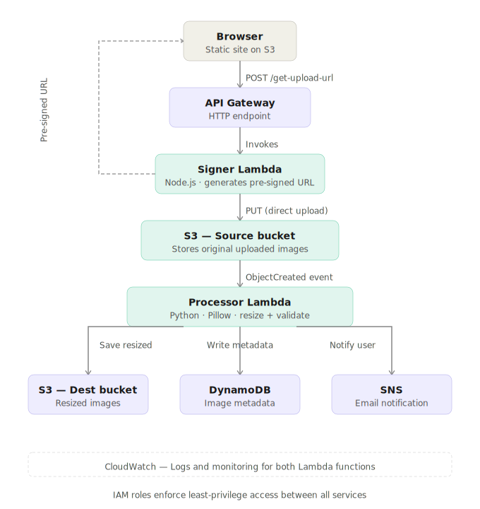

# Serverless Image Processing Pipeline on AWS

An event-driven, serverless pipeline that automatically resizes images uploaded via a static web frontend. No servers to manage — the entire workflow runs on AWS managed services.

---

## Architecture



---

## Services Used

| Service | Purpose |
|---|---|
| S3 (Source Bucket) | Stores original uploaded images, hosts static frontend |
| S3 (Destination Bucket) | Stores resized output images |
| API Gateway | Exposes HTTP endpoint to invoke the Signer Lambda |
| Lambda — Signer (Node.js) | Generates a temporary pre-signed URL for secure direct upload |
| Lambda — Processor (Python) | Triggered by S3 event; resizes image using Pillow |
| Lambda Layer | Packages Pillow binary dependency for the Linux Lambda environment |
| DynamoDB | Stores image metadata (filename, status, timestamp, S3 keys) |
| SNS | Sends email notification on successful processing |
| IAM | Least-privilege roles for each Lambda |
| CloudWatch | Logs and monitoring for both Lambda functions |

---

## How It Works — Step by Step

1. **User opens the frontend** hosted as a static website on S3.
2. **User selects a JPG or PNG** and clicks Upload.
3. **Frontend calls API Gateway** (`POST /get-upload-url`) with the filename and file type.
4. **Signer Lambda** validates the file type and returns a temporary **pre-signed S3 URL** (valid 5 minutes). AWS credentials are never exposed to the browser.
5. **Frontend uploads the image directly to S3** using the pre-signed URL via a `PUT` request.
6. **S3 fires an `ObjectCreated` event**, which automatically triggers the Processor Lambda.
7. **Processor Lambda**:
   - Downloads the image from the source bucket
   - Validates it is JPG or PNG
   - Handles PNG transparency (RGBA → RGB)
   - Resizes the image to fit within 800×800 px (aspect ratio preserved)
   - Uploads the resized image to the destination bucket under `/resized/`
8. **DynamoDB** record is written with: `imageId`, `originalFilename`, `sourceKey`, `resizedKey`, `status: PROCESSED`, `processedAt` timestamp.
9. **SNS** sends an email to the subscribed address with the filename, status, and timestamp.

---

## Project Structure

```
├── frontend/
│   └── index.html              # Static upload UI (hosted on S3)
│
├── signer/
│   └── index.js                # Lambda: generates S3 pre-signed URL
│
├── processor/
│   ├── lambda_function.py      # Lambda: resizes image, writes to DynamoDB, sends SNS
│   └── requirements.txt        # Pillow dependency (packaged as Lambda Layer)
│
└── screenshots/                # AWS Console screenshots
```

---

## DynamoDB Table Schema

**Table name:** `image-metadata`  
**Partition key:** `imageId` (String)

| Attribute | Type | Description |
|---|---|---|
| imageId | String | UUID generated per image |
| originalFilename | String | Original file name |
| sourceKey | String | S3 key in the source bucket |
| resizedKey | String | S3 key in the destination bucket |
| status | String | Always `PROCESSED` on success |
| processedAt | String | UTC ISO 8601 timestamp |

---

## SNS Email Notification Format

```
Subject: Image Processed Successfully

Image Processing Complete
───────────────────────────────────
Filename   : photo.jpg
Status     : PROCESSED
Timestamp  : 2024-11-10T08:45:23.412Z
Output     : s3://my-dest-bucket/resized/photo.jpg
```

---

## IAM — Principle of Least Privilege

**Signer Lambda role permissions:**
- `s3:PutObject` on source bucket only

**Processor Lambda role permissions:**
- `s3:GetObject` on source bucket
- `s3:PutObject` on destination bucket
- `dynamodb:PutItem` on the metadata table
- `sns:Publish` on the SNS topic

---

## Lambda Layer — Pillow Setup

Pillow requires native binaries compiled for Amazon Linux. A Lambda Layer was used to package it separately from the function code.

```bash
# Build the layer locally (Amazon Linux compatible)
mkdir -p layer/python
pip install pillow -t layer/python --platform manylinux2014_x86_64 --only-binary=:all:

# Zip and upload as a Lambda Layer in the AWS Console
cd layer && zip -r pillow-layer.zip python/
```

The Processor Lambda was then configured to use this layer.

---

## CORS Configuration

Two places required CORS setup:

**API Gateway** — enabled `Access-Control-Allow-Origin: *` on the `/get-upload-url` POST route and added an OPTIONS method for preflight.

**S3 Source Bucket** — added the following CORS rule to allow direct PUT uploads from the browser:

```json
[
  {
    "AllowedHeaders": ["*"],
    "AllowedMethods": ["PUT"],
    "AllowedOrigins": ["*"],
    "ExposeHeaders": []
  }
]
```

---

## Key Challenges & How They Were Solved

**1. CORS errors on upload**  
The browser blocked direct S3 uploads. Fixed by adding a CORS rule to the S3 bucket allowing `PUT` from any origin, and enabling CORS on API Gateway for the pre-signed URL endpoint.

**2. Pillow import errors in Lambda**  
Pillow requires native Linux binaries. Packaging it in a normal zip failed. Solved by building a dedicated Lambda Layer with `--platform manylinux2014_x86_64` to get the correct binaries.

**3. PNG transparency causing black thumbnails**  
PNG images with an alpha channel (RGBA mode) produced corrupted output when saved as JPEG. Fixed by compositing the RGBA image onto a white RGB background before saving.

**4. 403 Forbidden on S3 upload**  
The pre-signed URL was generated with a specific `ContentType`. The browser `PUT` request had to include the exact matching `Content-Type` header, otherwise S3 rejected it.

---

## What I Would Add Next

- [ ] Infrastructure as Code using **Terraform**
- [ ] **CloudFront** distribution in front of the S3 static site for HTTPS and caching
- [ ] Input validation on file size before upload (client-side)
- [ ] A status page that polls DynamoDB to show processing history
- [ ] Unit tests for the Processor Lambda

---

## Screenshots

> This project was built and tested on a live AWS account. The account has since been closed, so AWS Console screenshots are unavailable. The architecture diagram above, source code, and documentation reflect the actual implementation.

---

## Tech Stack

`AWS Lambda` · `Amazon S3` · `API Gateway` · `DynamoDB` · `SNS` · `Node.js` · `Python` · `Pillow`
